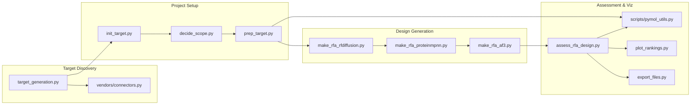
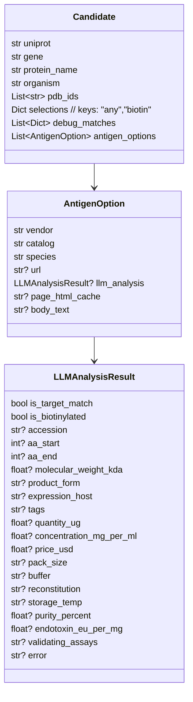

# RFAntibody Target‑to‑Binder Pipeline

End‑to‑end workflow to discover protein targets, scope epitopes, prepare structures, and generate de novo antibody binders using RFdiffusion → ProteinMPNN → AlphaFold3, with assessment and portable PyMOL visualization bundles.

## Overview

- Purpose: Automate discovery → epitope selection → structure prep → multi‑stage design → assessment.
- Orchestrator: `manage_rfa.py` wraps all phases and writes SLURM/Singularity jobs for HPC.
- Key stages:
  - Discovery: Vendor search + PDB mapping (`target_generation.py`, `vendors/connectors.py`).
  - Setup: Initialize target, LLM‑assisted scoping, SASA masks + hotspots (`init_target.py`, `decide_scope.py`, `prep_target.py`).
  - Design: RFdiffusion backbones → MPNN sequences → AF3 inference (`make_rfa_rfdiffusion.py`, `make_rfa_proteinmpnn.py`, `make_rfa_af3.py`).
  - Assessment/Viz: Rank, gallery bundles, and per‑design PyMOL scripts (`assess_rfa_design.py`, `scripts/pymol_utils.py`, `plot_rankings.py`).
  - Escape mapping: Antigen DMS library builder with PyMOL coverage visualization (`webapp/dms.py`, `/antigen-dms`).

```mermaid
flowchart TD
  A[Instruction or Query] --> B[target_generation.py]
  B -->|TSVs| C[targets_catalog/*.tsv]
  B -.->|Chosen PDB| D[init_target.py]
  D -->|raw PDB + verify| E[target.yaml + raw/]
  E --> F[decide_scope.py (LLM)]
  F -->|epitopes| G[prep_target.py (SASA + hotspots)]
  G -->|prepared.pdb, masks, hotspots| H{Arms: Epitope@Variant}
  H --> I[make_rfa_rfdiffusion.py]
  I -->|backbones| J[make_rfa_proteinmpnn.py]
  J -->|binder seqs| K[make_rfa_af3.py (Stage1/2)]
  K -->|AF3 predictions| L[assess_rfa_design.py]
  L -->|rankings + PML| M[plot_rankings.py / export_files.py / followup]
```



## Discovery Data Models



## Repository Layout

```
targets_catalog/        # Discovery TSV outputs (biotin/all/debug)
targets/<PDB>/
  raw/                  # RCSB entry.json, assembly_1.json, PDB/CIF, chainmap.json
  prep/                 # prepared.pdb, epitope masks + hotspot variants, metadata JSON
  designs/
    <Epitope>/hs-<V>/  # rfa_rfdiff, rfa_mpnn, rfa_af3 outputs per arm
    _assessments/      # af3_rankings.tsv, galleries, scripts
cache/target_generation/  # vendor HTML cache and logs
vendors/               # vendor connectors (SinoBio, ACRO)
scripts/               # PyMOL bundle helpers
tools/                 # generated SLURM scripts, helpers, launchers
```

## Typical CLI Flow

Discovery (local; Chromium + LLM batch parsing):

```
python manage_rfa.py target-generation \
  --instruction "top proteins for antibody therapeutics" \
  --max_targets 100 --species human --prefer_tags biotin --no_browser_popup
```

Initialize → Scope → Prep:

```
python manage_rfa.py init-target 6M17 \
  --antigen_url "https://www.sinobiological.com/recombinant-proteins/..."

python manage_rfa.py decide-scope 6M17

python manage_rfa.py prep-target 6M17 --sasa_cutoff 10.0
```

Design pipeline (arms suggested at the end of prep):

```
python manage_rfa.py pipeline 6M17 \
  --arm "RBM Core@A" --arm "RBM Core@B" --arm "RBM Core@C" \
  --total 900 --designs_per_task 100 \
  --num_seq 1 --temp 0.1 --binder_chain_id H [--submit]
```

Assessment and follow‑up:

```
python manage_rfa.py assess-rfa-all 6M17 --binder_chain_id H --run_label v1
python manage_rfa.py followup 6M17 --total 2000 --topk 2 --designs_per_task 20 --num_seq 16 --binder_chain_id H --submit
```

## Configuration & Requirements

- LLM & discovery:
  - `env.py` must define `GOOGLE_API_KEY`; install `google-generativeai`.
  - Playwright is used for vendor pages: `pip install playwright && python -m playwright install chromium`.
  - Python deps used in discovery: `bs4`, `requests`, `pyyaml`, `tenacity`, `httpx`, `fake_useragent`.
- Structure prep & assessment:
  - `biopython`, `freesasa`, `jsonschema`, `numpy`.
  - PyMOL not required on HPC; bundles are exported for offline viewing. Optional remote mode via `pymol-remote`.
- HPC & containers (design stages): set paths in `utils.py`:
  - `SINGULARITY_IMAGE_PATH` (RFAntibody), `RFANTIBODY_REPO_PATH`.
  - `AF3_SINGULARITY_IMAGE`, `AF3_MODEL_PARAMS_DIR`, `AF3_DATABASES_DIR`.
  - SLURM: `SLURM_GPU_PARTITION`, `SLURM_ACCOUNT`, `SLURM_GPU_TYPE`.

> Note: `utils.py` defines a hardcoded `ROOT` pointing to your project path. Adjust if your checkout differs.

## Key Entry Points

- Discovery: [`target_generation.py`](target_generation.py), [`vendors/connectors.py`](vendors/connectors.py)
- Init/Scope/Prep: [`init_target.py`](init_target.py), [`decide_scope.py`](decide_scope.py), [`prep_target.py`](prep_target.py)
- Design jobs: [`make_rfa_rfdiffusion.py`](make_rfa_rfdiffusion.py), [`make_rfa_proteinmpnn.py`](make_rfa_proteinmpnn.py), [`make_rfa_af3.py`](make_rfa_af3.py)
- Assessment/Viz: [`assess_rfa_design.py`](assess_rfa_design.py), [`scripts/pymol_utils.py`](scripts/pymol_utils.py)
- Orchestrator CLI: [`manage_rfa.py`](manage_rfa.py)

## Outputs

- Discovery TSVs: `targets_catalog/*_biotin.tsv`, `*_all.tsv`, `*_debug.tsv`.
- Target setup: `targets/<PDB>/raw/*`, `targets/<PDB>/target.yaml`.
- Prep artifacts: `targets/<PDB>/prep/prepared.pdb`, `epitope_*.json`, `epitopes_metadata.json`.
- Design results: `targets/<PDB>/designs/<Epitope>/hs-<V>/(rfa_rfdiff|rfa_mpnn|rfa_af3)`.
- Assessment: `targets/<PDB>/designs/_assessments/*/af3_rankings.tsv`, PyMOL bundles/galleries.
